# 交互设计
## 智能产品
### 智能⼿机
1. iPhoneX

|iphonex | 明细 | 评价 | 备注|
|- | :-: | :-: | -: |
|价格| ≈8300 | ⭐⭐⭐ | 
|主板 | 苹果A11+M11协处理器 额外添加ai芯片 | ⭐⭐⭐⭐⭐ | 
|屏幕 | 5.8 英寸OLED 刘海屏 | ⭐⭐⭐ |
|前摄像头 | 700万像素 结构光 | ⭐⭐⭐⭐⭐ | faceID|
|后摄像头 | 1200万像素 广角和长焦镜头 | ⭐⭐⭐⭐ |
|内存 | 3GB | ⭐⭐ |
|特殊原件 | nfc 无线充电 | ⭐⭐⭐⭐ |
|系统 | iOS | ⭐⭐⭐⭐ |

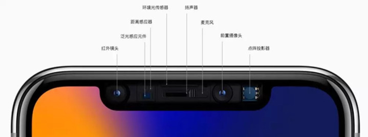

2. oppo find x 

|oppo find x | 明细 | 评价 | 备注|
|- | :-: | :-: | -: |
|价格| ≈5000 | ⭐⭐⭐⭐⭐ | 
|主板 | 高通 骁龙845 8核 | ⭐⭐⭐⭐⭐ | 
|屏幕 | 6.42英寸 全面屏 | ⭐⭐⭐⭐⭐ |
|前摄像头 | 2500万像素 | ⭐⭐⭐⭐⭐ | 滑盖式 结构光 |
|后摄像头 | 2000万像素+1600万像素 | ⭐⭐⭐⭐⭐ |
|内存 |  8GB 128G  | ⭐⭐⭐⭐⭐ |
|特殊原件 | 滑轨 | ⭐⭐⭐⭐⭐ |
|系统 | Color OS 5.1（基于Android 8.1） | ⭐⭐⭐ |

3. ⼩⽶8探索版

|⼩⽶8探索版 | 明细 | 评价 | 备注|
|- | :-: | :-: | -: |
|价格| ≈3700 | ⭐⭐⭐⭐⭐ | 
|主板 | 高通 骁龙845 8核 | ⭐⭐⭐⭐⭐ | 
|屏幕 | 6.21英寸 | ⭐⭐⭐⭐ |
|前摄像头 | 2000万像素 | ⭐⭐⭐⭐ | 
|后摄像头 | 1200万像素 广角和长焦镜头 | ⭐⭐⭐⭐ |
|内存 | 8GB 128G | ⭐⭐⭐⭐⭐ |
|特殊原件 | nfc | ⭐⭐⭐ |
|系统 | MIUI 9（基于Android 8.1） | ⭐⭐⭐⭐⭐ |

4. 三星note9

|三星note9 | 明细 | 评价 | 备注|
|- | :-: | :-: | -: |
|价格| ≈7000-9000 | ⭐⭐⭐ | 
|主板 | 高通 骁龙845 8核 | ⭐⭐⭐⭐⭐ | 
|屏幕 | 6.4英寸全视曲面屏 | ⭐⭐⭐⭐⭐ |
|前摄像头 | 800万像素 | ⭐⭐⭐ | 
|后摄像头 | 双1200万像素 | ⭐⭐⭐⭐ |
|内存 | 6GB/8GB | ⭐⭐⭐⭐ |
|特殊原件 |    
|系统 | Android | ⭐⭐⭐ |

5. 魅族16th Plus

|魅族16th Plus | 明细 | 评价 | 备注|
|- | :-: | :-: | -: |
|价格| 3200 | ⭐⭐⭐⭐ | 
|主板 | 高通 骁龙845 8核 | ⭐⭐⭐⭐⭐ | 
|屏幕 | 6.5英寸全面屏 | ⭐⭐⭐⭐⭐ |
|前摄像头 | 2000万像素 | ⭐⭐⭐ | 
|后摄像头 | 2000万像素+1200万像素 | ⭐⭐⭐⭐ |
|内存 | 6GB 128GB | ⭐⭐⭐ |
|特殊原件 | 屏下指纹 | ⭐⭐⭐⭐⭐ | 超声波半屏|
|系统 | Flyme OS | ⭐⭐⭐ |

6. 锤⼦（主要关注软件层⾯）

瓦达西瓦罗黑，就不看了

其他

海信双面屏手机A6

### 智能电视
1. apple tv

没找到什么亮点，待补充

2. 三星系列（关注它的附加功能亮点）

没找到什么亮点，待补充

3. 小米电视

可用米家物联网控制

### 智能⼿环

上课的时候功能方面写的都差不多了……

一般分贫民款￥200左右和土豪款￥1000以上 

Ex： 小米手环3 ￥169

华为B5 ￥1199

### 智能音箱

常见的： 天猫精灵，小度音箱，亚马逊Echo，小米小爱音箱

附：常见语音助手：Siri Cortana Assistant

IFA上新款：

丹麦扬声器品牌Bang & Olufsen推出了一款全新的扬声器，其外形和尺寸都独具一格。这款名为Beosound Edge的扬声器看起来像一个巨大的超极简主义轮子。用户可以把它竖着放在房间里，也可以把它挂在墙上，它有一些巧妙的内置设计：当用户接近扬声器时，接近传感器会使其触摸敏感界面（嵌入在铝带顶部）点亮。可以通过点击来启动和停止播放或跳过曲目，同时，当用户来回滚动扬声器时，可以上下调节音量。

Beosound Edge配备了AirPlay 2、Chromecast 2和蓝牙，并与Alexa和Google Assistant等语音助手兼容。

该款扬声器售价3250欧元（约合3770美元），将于11月中旬发售

索尼此次在IFA上首次推出了新款防水防尘智能扬声器。该款设备有多种颜色的灯；它的数字信号处理器可充分利用Extra Bass技术，来呈现出低音强劲、强有力的音频效果。另外还配备有一个闪烁的频闪灯。索尼声称该款设备的电池寿命可以达到16小时。此外，它还内置了语音助手Google Assistant。总之，这款扬声器持久耐用便携，可能完美适合派对场合。

新款索尼扬声器售价300美元，将于10月份上市。

### 智能⼿表
1. 苹果的Apple Watch

3Dtouch貌似放弃了
具体待补充 

2. 三星的Gear Watch

2018年8月10日消息 

三星在Galaxy Note手机上宣布了其可穿戴新品Galaxy Watch。全新的Galaxy Watch系列支持LTE连接和无线充电功能。不过，三星正式放弃了Gear品牌，全新的Watch系列将替代Gear。
使用的AMOLED触摸显示屏，配备大猩猩DX+玻璃并且防水，支持日常游泳级别的防水。在电池上，这款智能手表能保证日常两三天的使用。

3.  努比亚nubia-α

2018年8月31日消息 

与索尼的电子纸手表不同的是，这款手表采用的是全彩柔性屏幕，并且很清晰的看到中间部分旁边还有摄像头，并且两边的"侧翼"还具有两枚像Apple Watch一样的实体按键。

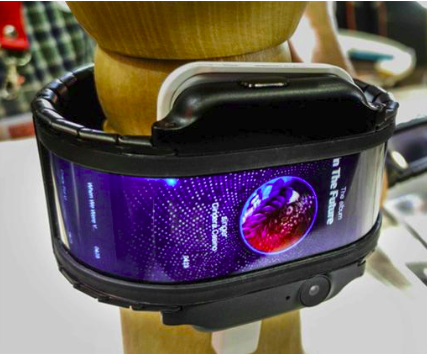

4. google pixel

遥遥无期
具体待补充 
特点是Wear OS新系统

### 虚拟现实 Virtual Reality

[百度百科](https://baike.baidu.com/item/%E8%99%9A%E6%8B%9F%E7%8E%B0%E5%AE%9E/207123?fromtitle=vr&fromid=764830&fr=aladdin "Title")

产品：
1. Oculus Rift 
2. HTC Vive
3. PSVR  索尼
4. Steam VR HTC+steam++新进厂商（如window VR）

### 增强现实 Augmented Reality
[百度百科](https://baike.baidu.com/item/%E5%A2%9E%E5%BC%BA%E7%8E%B0%E5%AE%9E/1889025?fromtitle=AR&fromid=3404706 "Title")

产品：
1. ARKit 苹果在2017年WWDC推出的AR开发平台。开发人员可以使用这套工具iPhone和iPad创建增强现实应用程序。
2. Google glass 停产了

### 混合现实 Mixed Reality

[百度百科](https://baike.baidu.com/item/%E6%B7%B7%E5%90%88%E7%8E%B0%E5%AE%9E/9991750 "Title")

1. Lightform

2. Google glass

3. Hololens⼀代和即将出的⼆代

### 智能⼿套
1. 聋哑人的福音

一个叫QuadSquad的团队设计出一款专门为聋哑人打造的智能手套。这款手套可以实现聋哑人和不懂手语的人之间的交流。当然还需要配备一台智能手机，它可以识别聋哑人的手语，并将它转换成语音让正常人识别，另一方面也可以将正常人的语音转换成文字让聋哑人阅读。

该手套通过15个柔韧的感应器检测手指动作，另外，手套上还有罗盘、重力感应器和陀螺仪，用来探测手指在空间的移动。虽然手语转化成语音或是文字技术已经比较成熟，但是准确率还是有待提升。

2、为盲人提供帮助

这款Tacit Project手套是Steve Hoefer发明的一种用氯丁橡胶制造的无指手套，可以利用声纳和虚拟触觉帮助盲人回避障碍物。它内置一个可发送接收超声波的收发器，可以探测10英尺之内的障碍物。并且它还可以准确告诉你，这个障碍物离你多远，多久会碰到。

上面提到两款为身体某些部位有残疾的人设计的，那么对于一个身体健全的人，智能手套又会多出怎样的功能呢？

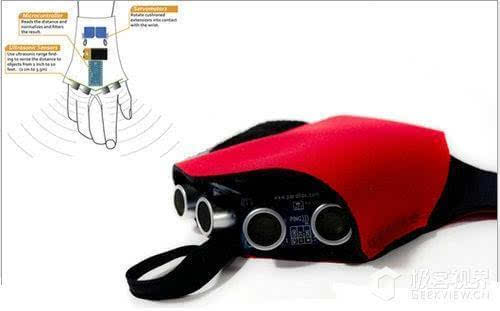

3、手势打电话

设计师Bryan Cera设计出一款可以依靠手势来打电话的手套—Glove One。说它是手套，还不如直接称它为手机得了。从上图中你可以清晰的看到戴上它，你的关节还是可以活动，手掌上每个关节都有一个物理拨号键。大拇指和小拇指分别是扬声器和话筒，就像平时我们做打电话手势一样，拨了号码就可以通话啦！它是通过USB充电的。

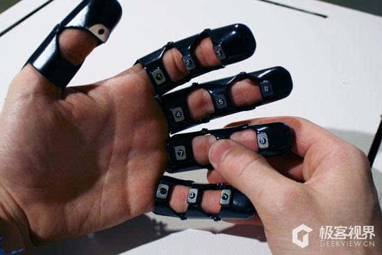

4、隔空操作手套

我们极客视界曾经介绍过这款手套，详情点击：隔空操作手套：冬天玩手机不动（冻）手。GoGlove外观设计实在低调，就跟自行车手套一样。但是却能控制音乐播放与电话接听。不仅如此，还能控制相机快门。比起眨眼拍照的眼镜，是不是还要方便一点？内置的电池能维持6个月的使用。但是你必须和智能手机相连，才能实现金手指的功能

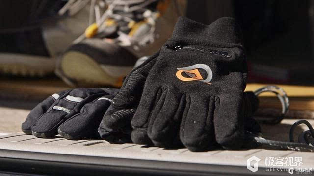
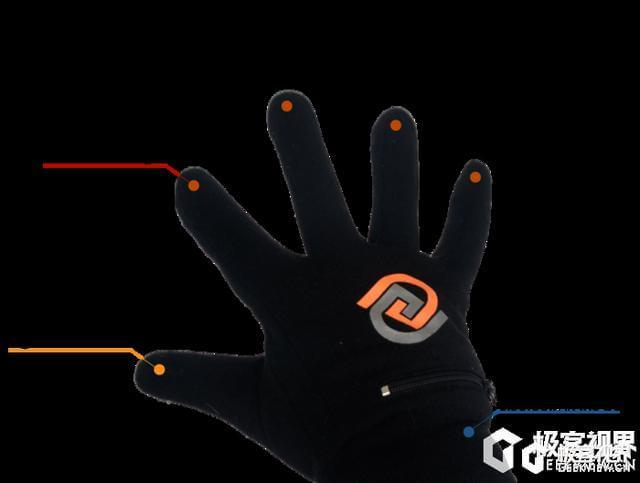

5、超性感手套

这款出自荷兰设计师Francesca Barchie之手的交互式智能手套，就单单从外形秒杀各类手套，黑丝般性感！它是一套戴在手上的、基于手势控制和3D投影的可穿戴智能设备。当你戴上它，将食指和拇指圈成一圈，放眼睛前面就能拍照。测物体长度也很方便，双手食指并拢再分开，再通过3D投影技术将结果投影出来。手势感应也可以解决正常人与聋哑人之间的沟通。

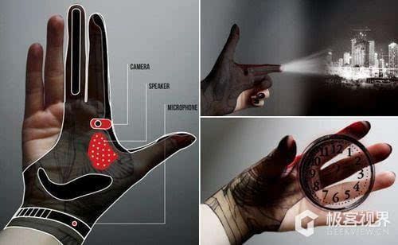

6、手套也可以做音乐

这对于热爱音乐的人来说可是一个惊喜。Aura是Cornell大学工程系的学生Ray Li发明的。它可以用一个小贝斯来创建一个可以监测磁场的传感器，这个传感器又可以将磁场内手的位置和方向传输到已经编好程序的接口，这些接口把数据转化为MIDI(音乐乐器数字接口)信号，然后可以通过合成器演奏这些信号。就像指挥官一样，手升高降低控制高低音，合拢就消声。

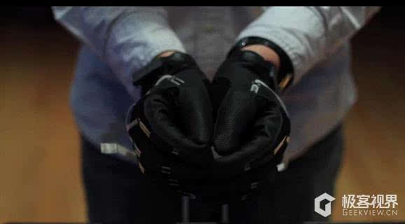

7、让你变身钢琴王子

羡慕台上那些钢琴演奏家，十个手指飞快在琴键上移动吗？那么令人陶醉的琴声，没个五六年，练不成。不过，有了这款手套，时间大大缩短。这款钢琴手套由美国乔治亚理工大学的研究者开发，佩戴后会产生微弱的电流，来刺激你每个手指头的神经。设定好琴谱后戴着它训练一段时间摘下手套，再经过适当的引导，手指放上钢琴就会不由自主地弹起手套所“教”的琴谱，多次重复训练后就会烂熟于胸。但是目前还是原型阶段，期待他的面世，一定会成为音乐界的传奇设备。

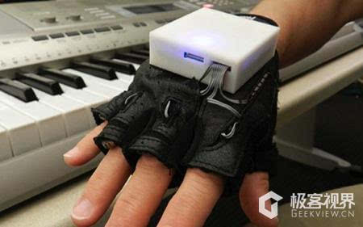

### 智能汽⻋

大众IDVizzion自动驾驶概念车

### 智能自行车

自行车配件：
  头盔，左右灯，姿态识别。

  Hovding 充气头盔

  车轮加灯
  
  无轮毂

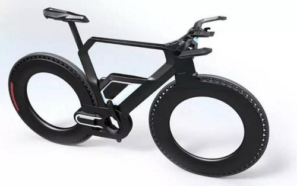

### 睡眠相关

1. 耳机、耳塞 
挂耳式、耳背式、骨传导不阻碍环境音、入耳式有两个麦克风。一个采集环境音。一个人声。

### 电脑

联想一连发布了几款Yoga系列的新品，其中最惹人注目的便是双屏设计的Yoga Book C930——采用一块电子墨水屏替代了实体键盘，以达到文字录入、书写绘画和阅读的作用。

### 空气相关
1. 甲醛 
自如事件

2. 通风系统

新风系统
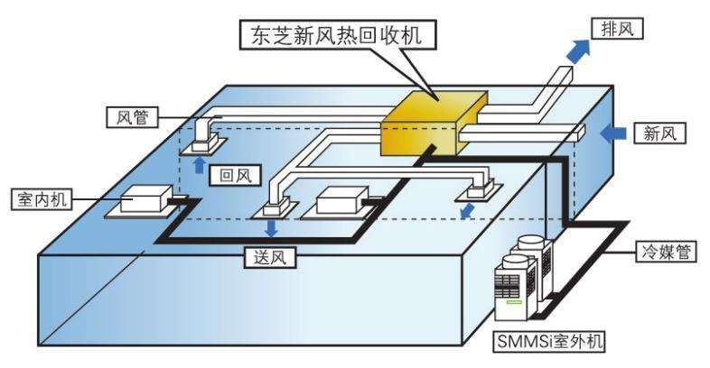

## 技术原理
### 体感技术
1. 惯性感测

[百度百科](https://baike.baidu.com/item/%E6%B7%B7%E5%90%88%E7%8E%B0%E5%AE%9E/9991750 "Title")

2. 光学感测

3. 光学与惯性联合感测

4. 电信号感测

5. ⽆线电信号

对号入座题：
kinect
Wii
PlayStation Move
Leap Motion
Prime Sense
Intel RealSense
EyeToy
MYO
IBeacon
KAI

### 眼球追踪技术
### 全息技术
### 深度成像
TOF
结构光
光场
双⽬摄像头
SLAM

### 传感器

加速度计
陀螺仪
温度传感器
磁⼒计
⽓压传感器
声⾳传感器
红外线传感器
### 信息传输相关
蓝⽛
RFID
NFC
红外线

### 屏幕
电阻屏
电容屏
墨⽔屏
柔性屏
全面屏解决方案：
  水滴屏
  美人尖
  齐刘海
  差异屏
### 声⾳传输
双⻨克⻛降噪技术
分层降噪技术
⻣传导技术
屏幕发声技术
### 数据传输
USBType-C

Lightning

苹果高速多功能I/O接口是2012年9月12日，美国旧金山芳草地会议中心苹果发布了全新的Lightning Dock接口，中文可将其译为”闪电”接口。新接口标准的发布，同时也意味着苹果使用了长达9年的30针Dock接口将被正式取代。

airdrop

### 图像识别

### 其他技术
屏下指纹
摄像头模组
ACC⾃适应巡航
奥迪智能⼤灯
⼈体⼯程学
⾊差补偿
镜头畸变

### 吹牛专用

#### 1.大数据 Big data
不用随机分析法（抽样调查）这样捷径，而采用所有数据进行分析处理。

大数据的5V特点（IBM提出）：Volume（大量）、Velocity（高速）、Variety（多样）、Value（低价值密度）、Veracity（真实性）。

适用领域 BI，工业4.0，云计算，物联网，人工智能

#### 2.区块链 blockchain
区块链是分布式数据存储、点对点传输、共识机制、加密算法等计算机技术的新型应用模式。
所谓共识机制是区块链系统中实现不同节点之间建立信任、获取权益的数学算法

应用： 智能合约，证券交易，电子商务，物联网，社交通讯，文件存储，存在性证明，身份验证，股权众筹。

特点：
1. 去中心化——由于使用分布式核算和存储，不存在中心化的硬件或管理机构，任意节点的权利和义务都是均等的，系统中的数据块由整个系统中具有维护功能的节点来共同维护。
2. 开放性——系统是开放的，除了交易各方的私有信息被加密外，区块链的数据对所有人公开，任何人都可以通过公开的接口查询区块链数据和开发相关应用，因此整个系统信息高度透明。
3. 自治性——区块链采用基于协商一致的规范和协议（比如一套公开透明的算法）使得整个系统中的所有节点能够在去信任的环境自由安全的交换数据，使得对“人”的信任改成了对机器的信任，任何人为的干预不起作用。
4. 信息不可篡改——一旦信息经过验证并添加至区块链，就会永久的存储起来，除非能够同时控制住系统中超过51%的节点，否则单个节点上对数据库的修改是无效的，因此区块链的数据稳定性和可靠性极高。
5. 匿名性——由于节点之间的交换遵循固定的算法，其数据交互是无需信任的（区块链中的程序规则会自行判断活动是否有效），因此交易对手无须通过公开身份的方式让对方对自己产生信任，对信用的累积非常有帮助。

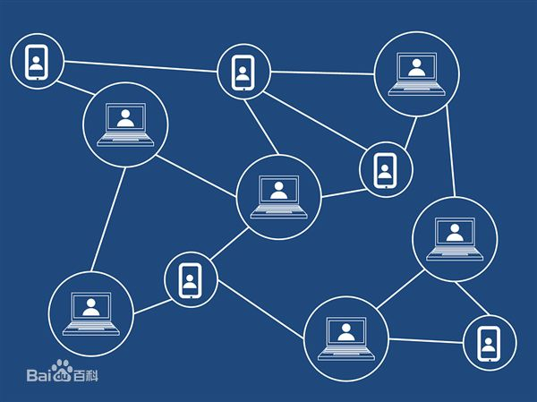

#### 3.云平台 cloud
基于云计算的平台

云计算是一种按使用量付费的模式，这种模式提供可用的、便捷的、按需的网络访问， 进入可配置的计算资源共享池（资源包括网络，服务器，存储，应用软件，服务），这些资源能够被快速提供，只需投入很少的管理工作，或与服务供应商进行很少的交互。 

应用：物联，安全，储存，计算，游戏。

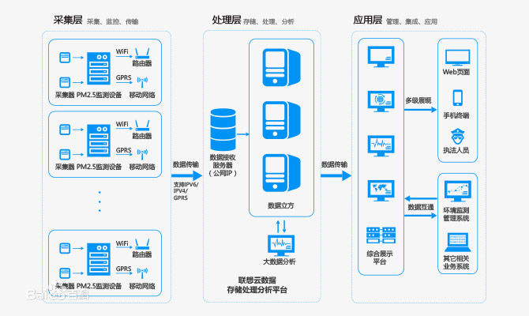

#### 4.物联网 Internet of things（IoT）

    常用技术：识别：RFID； 联网：wifi，ble，zigbee； 划分：局域，广域； 终端：交换机，路由器，手机；

    已有方案：
        NBIoT——窄带物联网（Narrow Band Internet of Things, NB-IoT）支持低功耗设备在广域网的蜂窝数据连接。
        NB-IoT支持待机时间长、对网络连接要求较高设备的高效连接。
        据说NB-IoT设备电池寿命可以提高至少10年，同时还能提供非常全面的室内蜂窝数据连接覆盖。

        MQTT（Message Queuing Telemetry Transport，消息队列遥测传输）
        是IBM开发的一个即时通讯协议，有可能成为物联网的重要组成部分。
        该协议支持所有平台，几乎可以把所有联网物品和外部连接起来，
        被用来当做传感器和制动器（比如通过Twitter让房屋联网）的通信协议。

        米家 网关用的zigbee

    画图参考：

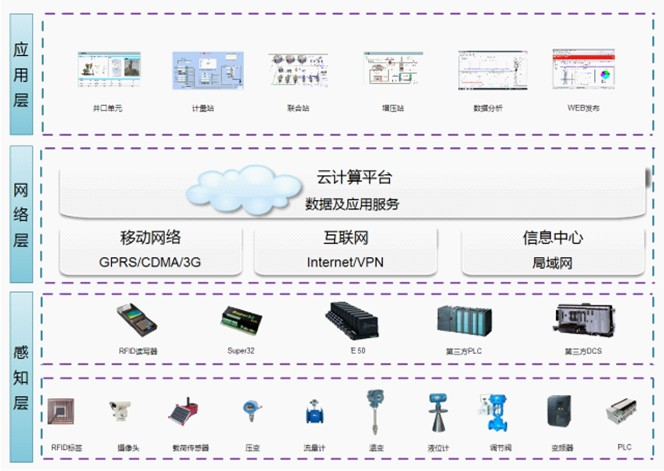
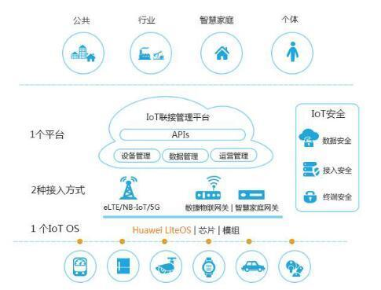
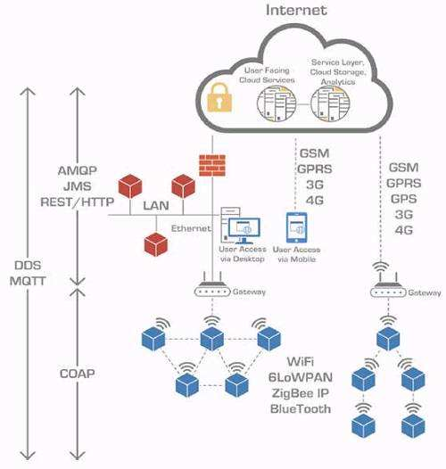

#### 5.人工智能 AI Artificial Intelligence
领域包括机器人、语言识别、图像识别、自然语言处理和专家系统等。

腾讯AI诊断帕金森

#### 6.卷积神经网络（Convolutional Neural Network,CNN）
深度学习的模型，由人类视觉原理得到灵感；

卷积Convolution过程：

池化pooling过程：

#### 7.TensorFlow
TensorFlow是谷歌基于DistBelief进行研发的第二代人工智能学习系统，其命名来源于本身的运行原理。Tensor（张量）意味着N维数组，Flow（流）意味着基于数据流图的计算，TensorFlow为张量从流图的一端流动到另一端计算过程。TensorFlow是将复杂的数据结构传输至人工智能神经网中进行分析和处理过程的系统。

## 专业设计必备
### 产品设计
#### 步骤
1. 审题找到题⽬要求，规划答题框架排版与时间
2. 5W1H造句，Where，When，What，Why，Who，How
3. 根据造的句寻找⽤户痛点进⾏针对性亮点设计
#### 框架
产品名称、产品背景、关键词
⽤户画像
产品设计
产品说明
信息框架
使⽤场景
产品评价
#### 注意事项
框架需要根据题⽬分数题量及时间进⾏灵活规划
思考问题⼀定要从全局开始思考，设计要具有完整性
对于交互⼀定要形成⼀个闭环，即对于每个输⼊都要有个输
功能设计尽量设计为主动性功能，但要考虑其充分必要性
要针对⽤户痛点特别设计killing par设计过程中要有⾃信，并且要能打动⾃⼰
### 产品评价
先指定⽤户画像，可以多⽤户画像
针对不同类⽤户根据右侧交互设计要完成的⽬标进⾏分点作答
给出是否可以优化，若可以给出⾃⼰的⻅解

分析方向：

能行性、安全性、通用性、易用性、易记性、容错性、用户满意度

自己设计的产品の评价：
先吹+不足+随着技术的发展可以解决。
### 技术原理考察
### 排版
### 画图
### APP设计注意事项

1. 新手指导
2. 正负反馈 如震动
3. 激励行为：如：榜单、签到

## 设计相关

